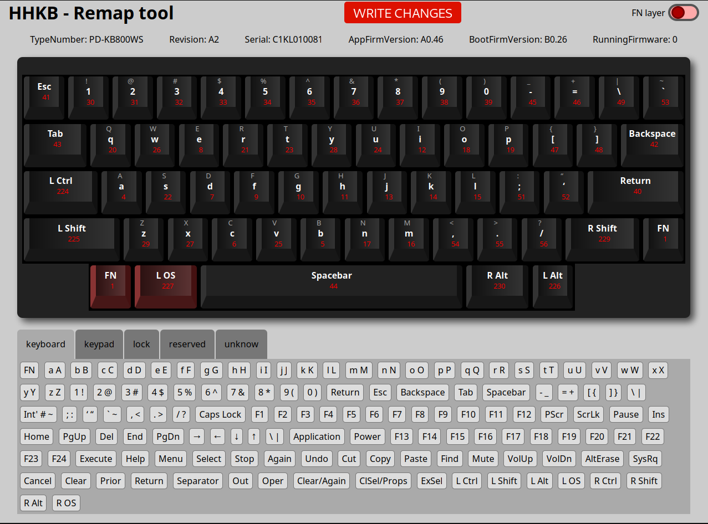

# HHG FRONTEND

This is a gui for "hhg" tool ( [https://gitlab.com/dom/happy-hacking-gnu](https://gitlab.com/dom/happy-hacking-gnu)).  
You can remap your HHKB (Happy Hacking Keyboard) Hybrid **ANSI** under Linux.

NOT FINISHED YET.  



## Requirements

- Node.JS (at least v16)
- webkit2gtk4.0

## How to compile

```sh
git clone https://github.com/steevelefort/hhg-gui.git
cd hhg-gui
chmod +x build.sh
./build.sh
```
Builds are now in the dist folder.

Builds were successfully made on 

- **Fedora** (39) 
- **OpenSuse Tumbleweed**.

## Usage

You could :
- Drag a scancode to assign it to a key
- Drag a key on another to swap the keys

## Warning

**IT IS EXPERIMENTAL. USE IT AT YOUR OWN RISK.**  
Beware, you can remap all keys and you could remove some standard shortcuts (change source, etc.)

## Roadmap

- The `hhkb-react/src/scancodes.js` file need to be modified/corrected to show all existing keys.
- A white theme have to be created (with CSS refactoring)
- Code need to be cleaned

## Licence

This software is released under the MIT.  


